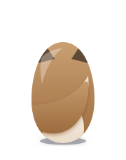
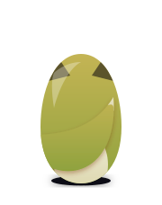
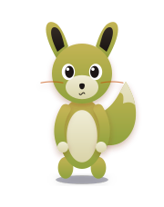

# Commit Pet

A little pet that grows as you commit — and gets to retire once your project ships.

**[commit-pet.vercel.app](https://commit-pet.vercel.app)**


## Install it on your repo

1. **[Install the GitHub App](https://github.com/apps/commit-pet)** and pick the repo(s) you want a pet for.
2. **Grab your repo's numeric ID** — there's no dashboard yet, so the quickest way is:
   ```bash
   curl -s https://api.github.com/repos/<owner>/<repo> | grep -m1 '"id"'
   ```
3. **Drop the badge in your own README**, swapping in that ID:
   ```md
   " alt="commit-pet badge" width="150" height="220" />
   ```

That's it — every commit from now on feeds your pet.

> **Note:** only public repos are supported right now — private repos 404 on the badge endpoint ([ADR-011](docs/adr/011-private-repo-badges-blocked.md)).

## Pet gallery

Your pet grows through four stages as XP accumulates, and its mood tints its colors based on repo health:

|               | Healthy                                                                                  | Tired                                                                                | Sick                                                                               |
| ------------- | ---------------------------------------------------------------------------------------- | ------------------------------------------------------------------------------------ | ---------------------------------------------------------------------------------- |
| **Egg**       |              |              |              |
| **Hatchling** |  |  |  |
| **Juvenile**  |    |    |    |
| **Adult**     |          |          |          |

Tired means health has dropped low; sick means the repo has open issues once it's deployed (see "How it works" below). These images are generated straight from the same art in [lib/pets/render.ts](lib/pets/render.ts) via `pnpm dlx tsx scripts/generate-pet-gallery.ts` — rerun that after any art change to keep this table in sync.

## How it works

Every repo with commit-pet installed gets its own pet, tied to that repo's activity:

- **Development phase** — the default. Every commit feeds the pet: health goes up, and it grows through four stages as XP accumulates — `egg` → `hatchling` → `juvenile` → `adult`.
- **Deployed phase** — entered once a release is published (or an agent explicitly marks it deployed via MCP). The pet stops needing commits and instead gets **sick** if the repo has open issues.

The badge above is a live, embeddable SVG (`/api/badge/[repoId]`) — same backend, same pet state, just a different view than the eventual dashboard.

## Workflow

```text
push → webhook → recordCommit() → Postgres (xp, health)
                                        │
        GET /api/badge/[repoId] ───────┘
                │
        currentHealth() → renderPetSvg() → SVG
```

1. **Push** — you push a commit to a repo with the GitHub App installed.
2. **Webhook** — GitHub POSTs a signed `push` event to `/api/github/webhooks`.
3. **Write** — the handler verifies the signature and calls `recordCommit()`, which bumps `xp` and `health` in Postgres.
4. **Render** — on the next request to `/api/badge/[repoId]`, the route reads the current row, applies lazy health decay via `currentHealth()`, and passes the result to `renderPetSvg()` to generate the SVG.

No cron job, no cached image — pet state is only ever written by a webhook or an MCP call (see "How it works" above), and every badge request renders straight from whatever's in the database at that moment.

See [docs/glossary.md](docs/glossary.md) for the full vocabulary, and [docs/adr/](docs/adr/) for the reasoning behind each mechanic.
